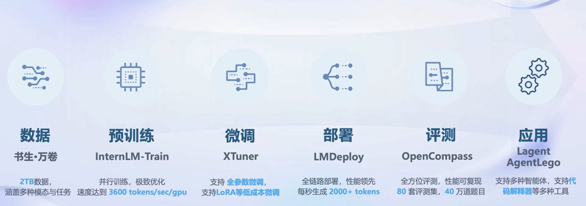
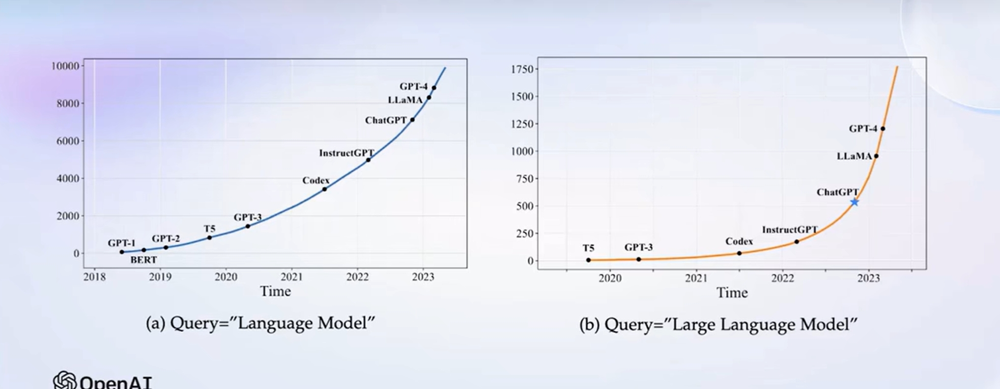
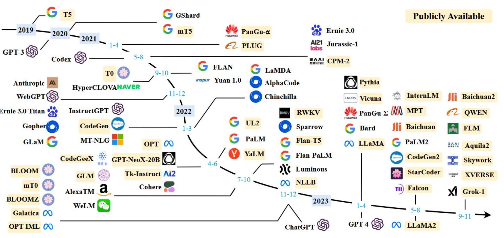

# 【Lecture 1】书生·浦语大模型全链路开源开放体系

## 一、书生·浦语全链条开源开放体系
### 1.书生·浦语系列大模型

|名称|参数量|特点|适用场景|
|:-|:-|:-|:-|
|InternLM-7B|70亿|小巧轻便，便于部署 支持8k语境窗口长度 支持多种工具调用模板|社区低成本可用最佳模型规模|
|InternLM-20B|200亿|在模型能力和推理代价间取得平衡 采用深而窄的结构，降低推理计算量但提高了推理能力 4k训练语境长度，推理时可外推至16k|商业场景可开发定制高精度、较小模型规模
|InternLM-123B|1230亿|具备极强的推理能力、全面的知识覆盖、超强理解能力和对话能力 准确的API调用能力，可实现各类Agent|通用大模型能力全面覆盖、千亿模型规模|

### 2.书生·浦语全链条开源开放体系

* **数据**：书生·万卷，[OpenDataLab](https://opendatalab.com/)
  * 2TB数据，涵盖多种模态与任务
  * 支持30+种模态
* **预训练**：[InternLM-Train](https://github.com/InternLM/InternLM/blob/main/doc/en/usage.md)
  * 支持8卡到千卡训练
  * 速度达到3600 tokens/sec/gpu
* **微调**：[XTuner](https://github.com/InternLM/xtuner)
  * 支持增量续训
  * 支持全参数微调
  * 支持LoRA等低成本微调
* **部署**：[LMDeploy](https://github.com/InternLM/lmdeploy)
  * 每秒生成2000+ tokens
* **评测**：[OpenCompass](https://github.com/open-compass/opencompass)
  * 80套评测集，40万道题目，全方位评测
* **应用**：[Lagent](https://github.com/InternLM/lagent)，[AgentLego](https://github.com/InternLM/agentlego)
  * 支持多种智能体，支持代码解释器等多种工具
## 二、大预言模型简介

### 1.大模型概述
#### 1.1 大模型的发展历程

大语言模型，例如GPT-3、BERT等，展示了在自然语言处理领域的显著能力。这些模型通过在大量文本数据上进行训练，学习了语言的复杂模式和结构。

**大模型已发展成为通用人工智能的重要途经！**

> <small> **Reference**: Zhao W X, Zhou K, Li J, et al. A survey of large language models[J]. arXiv preprint arXiv:2303.18223, 2023.</small>

#### 1.2 常见大模型

### 2.大语言模型的能力
#### 2.1 主要能力

* **文本生成**: 能够生成连贯、有逻辑的文本，应用于内容创作、自动写作等领域。
* **语言理解**: 理解和解释自然语言，支持任务如情感分析、文本分类、语言推断等。
* **问答系统**: 根据给定的问题，提供准确的答案，应用于聊天机器人、搜索引擎等。
* **机器翻译**：高效地将一种语言翻译成另一种语言，提高跨语言交流的便利性。
* **语音识别**：将语音转换为文本，适用于语音助手、自动字幕生成等。
* **文本摘要**：提炼关键信息，生成简洁的摘要，用于新闻摘要、报告简化等

#### 2.2 特点
* **大规模训练数据**: 使用庞大且多样化的文本数据集进行训练。
* **深度学习技术**: 利用最新的深度学习技术，如Transformer架构。
* **广泛应用**: 应用于多种行业和领域，如教育、医疗、金融等。
* **持续进步**：随着研究的深入和技术的发展，这些模型不断进化，能力不断增强。

